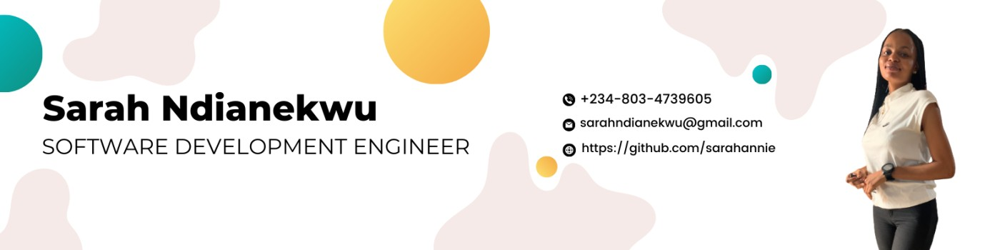

# Sarah Ndianekwu
## 

  
  

<h1>
Hi there 
</h1>

### About me

My name is Sarah Ndianekwu, I am a full stack developer. As a software developer with 2 years of experience, I have gained a solid foundation in software development principles and have practical experience creating a variety of software applications using programming languages such as C, JavaScript, and Python. 

I have experience with tools and frameworks such as Git, React, and Angular, and am familiar with agile development methodologies like Scrum and Lean. I have a strong understanding of software design patterns and architecture principles, and am able to write clean, efficient, and well-documented code. In addition, I have experience with testing and debugging techniques, including unit testing and integration testing, and am skilled at troubleshooting and debugging code. 

I am a strong problem-solver with good communication and collaboration skills, and am able to work effectively in a team environment. I am seeking opportunities to continue learning and expanding my skills and knowledge in the field, and am eager to contribute to the development of complex software systems.

## Skillset

  &nbsp;
  &nbsp;
  &nbsp;
  &nbsp;
  &nbsp;
  &nbsp;
  &nbsp;
  &nbsp;
  &nbsp;
  &nbsp;
  &nbsp;
  &nbsp;

### :fire: My Stats :

<!--
**sarahannie/sarahannie** is a ✨ _special_ ✨ repository because its `README.md` (this file) appears on your GitHub profile.

Here are some ideas to get you started:

- 🔭 I’m currently working on ...
- 🌱 I’m currently learning ...
- 👯 I’m looking to collaborate on ...
- 🤔 I’m looking for help with ...
- 💬 Ask me about ...
- 📫 How to reach me: ...
- 😄 Pronouns: ...
- ⚡ Fun fact: ...
-->
